New York - Taxi
================
Thomas Bury
Data Office - Advanced Analytics
Allianz
2018-10-31


Another notebook on the New York taxi data
==========================================

A super minimal example to illustrate how to aggregate millions of rows and plot the results in an (almost) intelligible way. As usual I mainly use ggplot2 and data.table. This code is super redundant and not well written (way too much ctrl+C ctrl+V). It's heavily based on the wonderful blog: <http://toddwschneider.com/posts/analyzing-1-1-billion-nyc-taxi-and-uber-trips-with-a-vengeance/> The prettiest visualization is probably: <https://towardsdatascience.com/if-taxi-trips-were-fireflies-1-3-billion-nyc-taxi-trips-plotted-b34e89f96cfa>

Last, if you don't want to process all the data files, you can use the `ygv_taxi.csv` file which is the count of pickups and dropoffs for the Yellow-Green-Vehicle cabs. The aggregation is done by coordinates (4 decimals) and is significantly lighter than processing all the other csv files. 

Import and clean the data and shapefile
=======================================

Taxi data
---------

``` r
min_lat <- 40.5774
max_lat <- 40.9176
min_long <- -74.15
max_long <- -73.7004
n_trip = 1e6
n_dec = 4

# https://catalog.data.gov/dataset?publisher=data.cityofnewyork.us&res_format=JSON&tags=taxi&organization=city-of-new-york
# https://github.com/r-shekhar/NYC-transport
taxi_trip = fread("nyc_taxi_data_2014.csv", header=TRUE)

taxi_trip = taxi_trip[(pickup_longitude > min_long) & (pickup_longitude < max_long) & (pickup_latitude > min_lat) & (pickup_latitude < max_lat)&
              (dropoff_longitude > min_long) & (dropoff_longitude< max_long) & (dropoff_latitude > min_lat) & (dropoff_latitude < max_lat),
                      .(pickup_longitude, pickup_latitude, dropoff_longitude, dropoff_latitude)][, lapply(.SD, round, n_dec)]

taxi_trip_pickup = taxi_trip[, .N, by = .(pickup_longitude, pickup_latitude)]
taxi_trip_dropoff = taxi_trip[, .N, by = .(dropoff_longitude, dropoff_latitude)]
setnames(taxi_trip_pickup, c('pickup_longitude', 'pickup_latitude'), c('longitude', 'latitude'))
setnames(taxi_trip_dropoff, c('dropoff_longitude', 'dropoff_latitude'), c('longitude', 'latitude'))

# green taxis
g_taxi_trip = fread("2016_Green_Taxi_Trip_Data.csv", header=TRUE)
colnames(g_taxi_trip) = tolower(colnames(g_taxi_trip))

g_taxi_trip = g_taxi_trip[(pickup_longitude > min_long) & (pickup_longitude < max_long) & (pickup_latitude > min_lat) & (pickup_latitude <   max_lat)&(dropoff_longitude > min_long) & (dropoff_longitude< max_long) & (dropoff_latitude > min_lat) & (dropoff_latitude < max_lat),
                      .(pickup_longitude, pickup_latitude, dropoff_longitude, dropoff_latitude)][, lapply(.SD, round, n_dec)]

g_taxi_trip_pickup = g_taxi_trip[, .N, by = .(pickup_longitude, pickup_latitude)]
g_taxi_trip_dropoff = g_taxi_trip[, .N, by = .(dropoff_longitude, dropoff_latitude)]
setnames(g_taxi_trip_pickup, c('pickup_longitude', 'pickup_latitude'), c('longitude', 'latitude'))
setnames(g_taxi_trip_dropoff, c('dropoff_longitude', 'dropoff_latitude'), c('longitude', 'latitude'))

# for hire vehicles (Uber, etc.)
v_taxi_trip = fread("uber-raw-data-apr14.csv", header=TRUE)
v_taxi_trip = rbind(v_taxi_trip, fread("uber-raw-data-may14.csv", header=TRUE))
v_taxi_trip = rbind(v_taxi_trip, fread("uber-raw-data-jun14.csv", header=TRUE))
v_taxi_trip = rbind(v_taxi_trip, fread("uber-raw-data-jul14.csv", header=TRUE))
v_taxi_trip = rbind(v_taxi_trip, fread("uber-raw-data-aug14.csv", header=TRUE))
v_taxi_trip = rbind(v_taxi_trip, fread("uber-raw-data-sep14.csv", header=TRUE))

colnames(v_taxi_trip) = tolower(colnames(v_taxi_trip))

v_taxi_trip = v_taxi_trip[(lon > min_long) & (lon < max_long) & (lat > min_lat) & (lat <   max_lat),
                      .(lon, lat)][, lapply(.SD, round, n_dec)]

v_taxi_trip_pickup = v_taxi_trip[, .N, by = .(lon, lat)]
#v_taxi_trip_dropoff = v_taxi_trip[, .N, by = .(lon, lat)] # no info
setnames(v_taxi_trip_pickup, c('lon', 'lat'), c('longitude', 'latitude'))
#setnames(g_taxi_trip_dropoff, c('dropoff_longitude', 'dropoff_latitude'), c('longitude', 'latitude'))
```

Shapefile and merging the data.table
------------------------------------

``` r
# import spatial data for census tracts and neighborhoods
nyc_sp = readOGR(dsn = "nybb_18c/nybb.shp", stringsAsFactors = F)
```

    ## OGR data source with driver: ESRI Shapefile 
    ## Source: "D:\Users\EUDZ040\R\Taxi-trips\nybb_18c\nybb.shp", layer: "nybb"
    ## with 5 features
    ## It has 4 fields

``` r
#nyc_sp = readOGR(dsn = "nyu_2451_34513/nyu_2451_34513.shp", stringsAsFactors = F)

nyc_sp_df = fortify(nyc_sp)
```

    ## Regions defined for each Polygons

``` r
proj4string(nyc_sp)
```

    ## [1] "+proj=lcc +lat_1=40.66666666666666 +lat_2=41.03333333333333 +lat_0=40.16666666666666 +lon_0=-74 +x_0=300000 +y_0=0 +datum=NAD83 +units=us-ft +no_defs +ellps=GRS80 +towgs84=0,0,0"

``` r
# from data.table to SpatialPointDataFrame
coordinates(taxi_trip_pickup)<-~longitude+latitude
class(taxi_trip_pickup)
```

    ## [1] "SpatialPointsDataFrame"
    ## attr(,"package")
    ## [1] "sp"

``` r
coordinates(taxi_trip_dropoff) <-~longitude+latitude
class(taxi_trip_pickup)
```

    ## [1] "SpatialPointsDataFrame"
    ## attr(,"package")
    ## [1] "sp"

``` r
coordinates(g_taxi_trip_pickup)<-~longitude+latitude
class(g_taxi_trip_pickup)
```

    ## [1] "SpatialPointsDataFrame"
    ## attr(,"package")
    ## [1] "sp"

``` r
coordinates(g_taxi_trip_dropoff) <-~longitude+latitude
class(g_taxi_trip_pickup)
```

    ## [1] "SpatialPointsDataFrame"
    ## attr(,"package")
    ## [1] "sp"

``` r
coordinates(v_taxi_trip_pickup)<-~longitude+latitude
class(v_taxi_trip_pickup)
```

    ## [1] "SpatialPointsDataFrame"
    ## attr(,"package")
    ## [1] "sp"

``` r
proj4string(taxi_trip_pickup) = CRS("+proj=longlat +datum=NAD83")
proj4string(taxi_trip_dropoff) = CRS("+proj=longlat +datum=NAD83")
proj4string(g_taxi_trip_pickup) = CRS("+proj=longlat +datum=NAD83")
proj4string(g_taxi_trip_dropoff) = CRS("+proj=longlat +datum=NAD83")
proj4string(v_taxi_trip_pickup) = CRS("+proj=longlat +datum=NAD83")
# now we can use the spTransform function to project. We will project
# the mapdata and for coordinate reference system (CRS) we will
# assign the projection from counties

taxi_trip_pickup  = spTransform(taxi_trip_pickup, CRS(proj4string(nyc_sp)))
taxi_trip_dropoff = spTransform(taxi_trip_dropoff, CRS(proj4string(nyc_sp)))
g_taxi_trip_pickup  = spTransform(g_taxi_trip_pickup, CRS(proj4string(nyc_sp)))
g_taxi_trip_dropoff = spTransform(g_taxi_trip_dropoff, CRS(proj4string(nyc_sp)))
v_taxi_trip_pickup  = spTransform(v_taxi_trip_pickup, CRS(proj4string(nyc_sp)))
# double check that they match
identical(proj4string(taxi_trip_dropoff),proj4string(nyc_sp))
```

    ## [1] TRUE

``` r
## [1] TRUE

# ggplot can't deal with a SpatialPointsDataFrame so we can convert back to a data.frame
taxi_trip_pickup = setDT(data.frame(taxi_trip_pickup))
taxi_trip_pickup = taxi_trip_pickup[, `:=`(drop = "on", col_tax = "yellow")]
taxi_trip_dropoff = setDT(data.frame(taxi_trip_dropoff))
taxi_trip_dropoff = taxi_trip_dropoff[, `:=`(drop = "off", col_tax = "yellow")]

y_taxi = rbind(taxi_trip_pickup, taxi_trip_dropoff)
y_taxi = y_taxi[, `:=`(drop = as.factor(drop), col_tax = as.factor(col_tax))]


g_taxi_trip_pickup = setDT(data.frame(g_taxi_trip_pickup))
g_taxi_trip_pickup = g_taxi_trip_pickup[, `:=`(drop = "on", col_tax = "green")]
g_taxi_trip_dropoff = setDT(data.frame(g_taxi_trip_dropoff))
g_taxi_trip_dropoff = g_taxi_trip_dropoff[, `:=`(drop = "off", col_tax = "green")]

g_taxi = rbind(g_taxi_trip_pickup, g_taxi_trip_dropoff)
g_taxi = g_taxi[, `:=`(drop = as.factor(drop), col_tax = as.factor(col_tax))]

v_taxi_trip_pickup = setDT(data.frame(v_taxi_trip_pickup))
v_taxi_trip_pickup = v_taxi_trip_pickup[, `:=`(drop = "on", col_tax = "hire")]

v_taxi = v_taxi_trip_pickup
v_taxi = v_taxi[, `:=`(drop = as.factor(drop), col_tax = as.factor(col_tax))]

ygv_taxi = rbind(y_taxi, g_taxi, v_taxi)

nyc_sp@data$id = as.character(as.numeric(rownames(nyc_sp@data)))
nyc_sp.points = fortify(nyc_sp)
```

    ## Regions defined for each Polygons

``` r
nyc_sp.map = inner_join(nyc_sp.points, nyc_sp@data, by = "id")

nyc_map = nyc_sp.map
ex_staten_island_map = filter(nyc_sp.map, BoroName != "Staten Island")
manhattan_map = filter(nyc_sp.map, BoroName == "Manhattan")
```

Plot the aggregated data
========================

Pickups
-------

``` r
p_y = ggplot() +
  geom_polygon(data = ex_staten_island_map,
               aes(x = long, y = lat, group = group),
               fill = "#3d3d3d", color = "#3d3d3d") +
  geom_point(data = taxi_trip_pickup[N>3],
             aes(x = longitude, y = latitude), color = "#f4cb38", alpha = .006, size = .01 ) +
  title_with_subtitle("New York City Taxi Pickups", "2014") +
  theme_dark_map(base_size = 24) +
  theme(legend.position = "none") + labs(caption="github ThomasBury")

p_g = ggplot() +
  geom_polygon(data = ex_staten_island_map,
               aes(x = long, y = lat, group = group),
               fill = "#3d3d3d", color = "#3d3d3d") +
  geom_point(data = g_taxi_trip_pickup[N>3],
             aes(x = longitude, y = latitude), color = "#4bd87f", alpha = .006, size = .01 ) +
  title_with_subtitle("New York City Green Taxi Pickups", "2016") +
  theme_dark_map(base_size = 24) +
  theme(legend.position = "none") + labs(caption="github ThomasBury")

p_v = ggplot() +
  geom_polygon(data = ex_staten_island_map,
               aes(x = long, y = lat, group = group),
               fill = "#3d3d3d", color = "#3d3d3d") +
  geom_point(data = v_taxi_trip_pickup[N>3],
             aes(x = longitude, y = latitude), color = "#1EBAD6", alpha = .006, size = .01 ) +
  title_with_subtitle("New York City Uber Pickups", "2014") +
  theme_dark_map(base_size = 24) +
  theme(legend.position = "none") + labs(caption="github ThomasBury")

plot_grid(p_y, p_g, p_v, ncol=3)
```

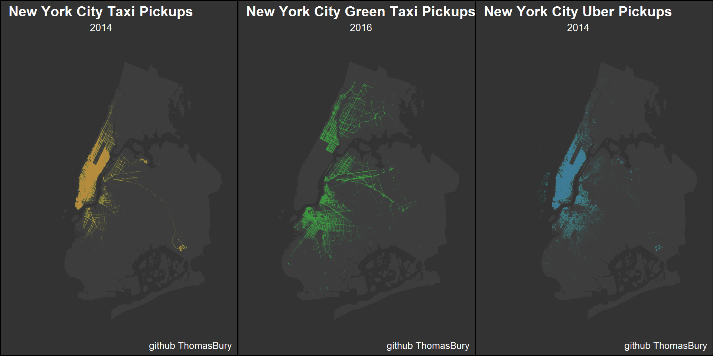

Overlay the three kind of cabs

``` r
# alpha_range = c(0.2, 0.8)
# size_range = c(0.134, 0.173)

colors_taxi = c("#FFEA00", "#4bd87f", "#1EBAD6")

p_ygv = ggplot() +
  geom_polygon(data = ex_staten_island_map,
               aes(x = long, y = lat, group = group),
               fill = "#3d3d3d", color = "#3d3d3d") +
  geom_point(data = ygv_taxi[N>3 & drop == "on"],
             aes(x = longitude, y = latitude, color = col_tax), alpha = .005, size = .01 ) +
  title_with_subtitle("New York City Taxi Pickups", "yellow, green and Uber cabs") +
  theme_dark_map(base_size = 24) + scale_colour_manual(values = colors_taxi) + 
  theme(legend.position = "none") + labs(caption="github ThomasBury")


p_ygv
```

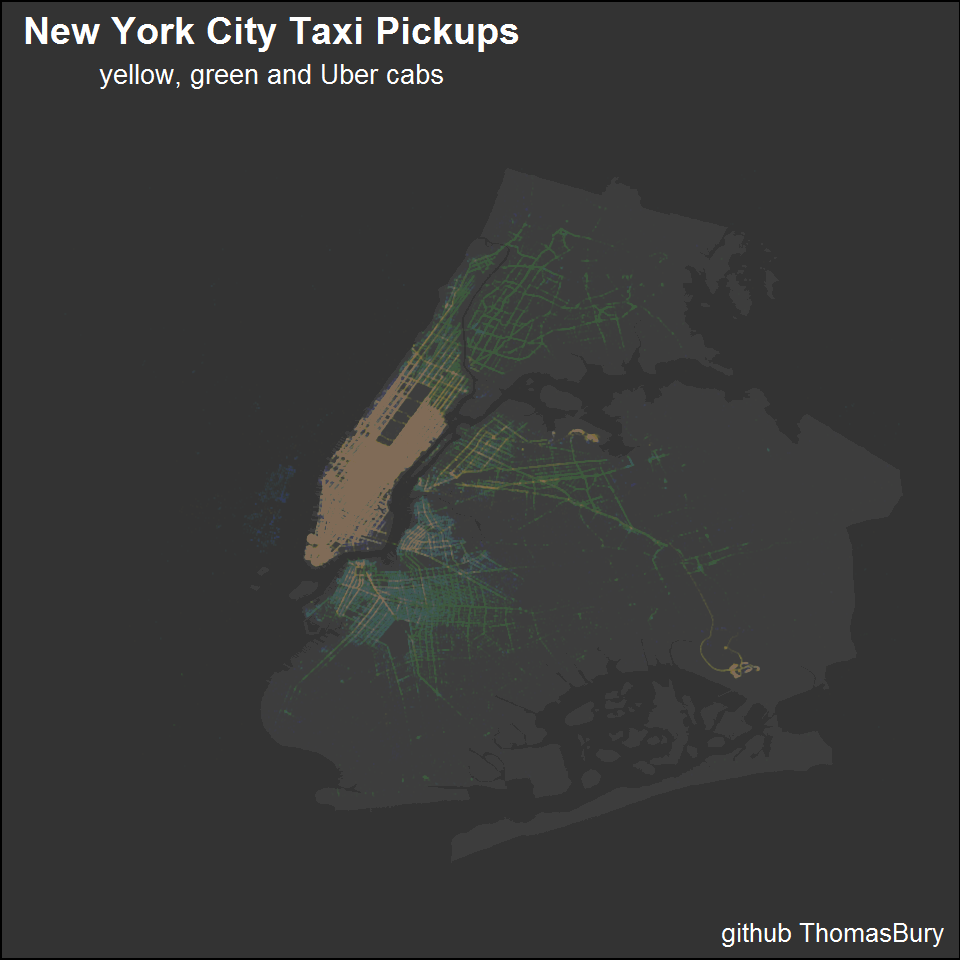

Pretty ugly, let's use another colour palette (which will highlight the number of pickups)

``` r
alpha_range = c(0.005, 0.02)

# quantile breaks
#breaks_vec = as.numeric(quantile(log(log(ygv_taxi[N>5 & drop == "on"]$N)), seq(0,1,.1)))

# log breaks
breaks_vec = exp(seq(log( min(log(log(ygv_taxi[N>5 & drop == "on"]$N)))  ), log( max(log(log(ygv_taxi[N>5 & drop == "on"]$N)))  ), length.out = 10))

p_ygv_sc = ggplot() +
  geom_polygon(data = ex_staten_island_map,
               aes(x = long, y = lat, group = group),
               fill = "#3d3d3d", color = "#3d3d3d") +
  geom_point(data = ygv_taxi[N>5 & drop == "on"],
             aes(x = longitude, y = latitude, color = log(log(N)), alpha = log(log(N))), size = .01) +
  scale_alpha_continuous(range = alpha_range, breaks = rev(breaks_vec)) +
  title_with_subtitle("New York City Taxi Pickups", "yellow, green and Uber cabs") +
  theme_dark_map(base_size = 24) + scale_color_viridis(option = "A", breaks = breaks_vec)  +
  theme(legend.position = "none") + labs(caption="github ThomasBury")


p_ygv_sc
```

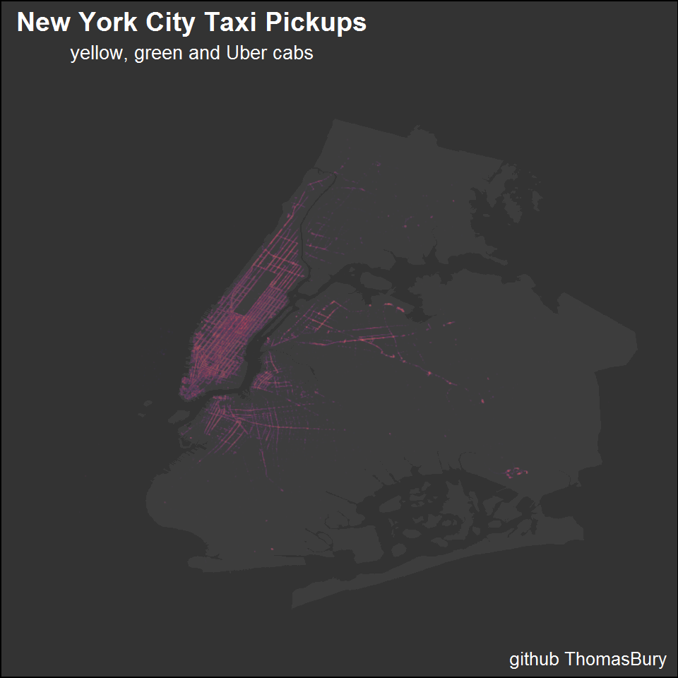

Or all white

``` r
alpha_range = c(0.005, 0.02)

p_ygv_sc = ggplot() +
  geom_polygon(data = ex_staten_island_map,
               aes(x = long, y = lat, group = group),
               fill = "#3d3d3d", color = "#3d3d3d") +
  geom_point(data = ygv_taxi[N>5 & drop == "on"],
             aes(x = longitude, y = latitude, alpha = log(log(N))), size = .0025, color = "white") +
  scale_alpha_continuous(range = alpha_range, breaks = rev(breaks_vec)) +
  title_with_subtitle("New York City Taxi Pickups", "yellow, green and Uber cabs") +
  theme_dark_map(base_size = 24)  +
  theme(legend.position = "none") + labs(caption="github ThomasBury")


p_ygv_sc
```

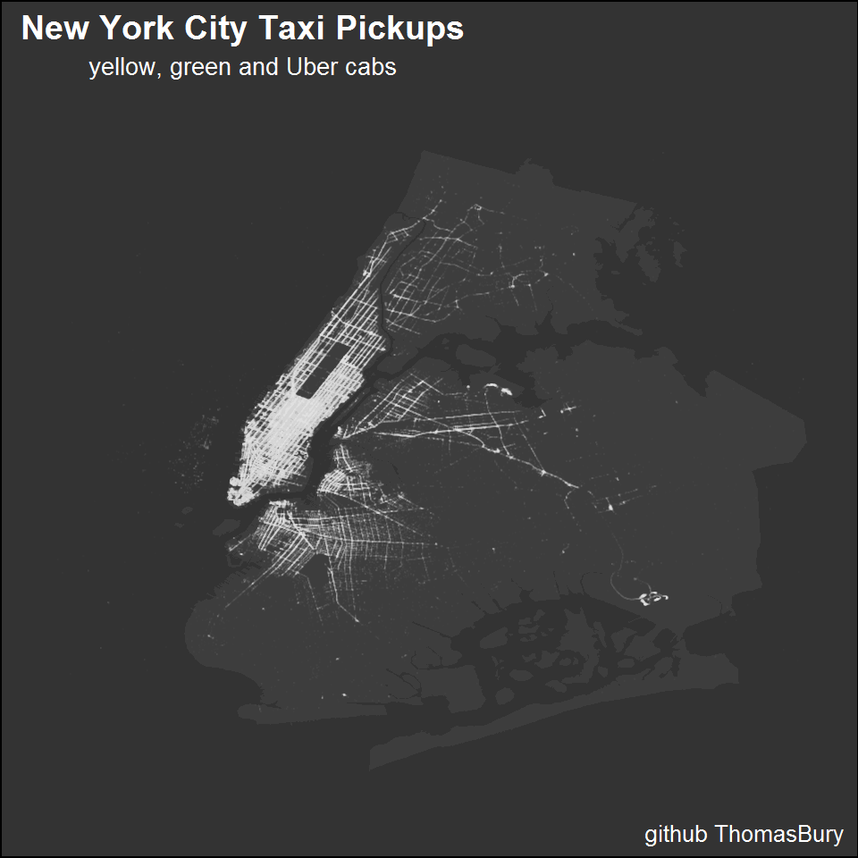

Gray scale

``` r
alpha_range = c(0.005, 0.02)

# quantile breaks
#breaks_vec = as.numeric(quantile(log(log(ygv_taxi[N>5 & drop == "on"]$N)), seq(0,1,.1)))

# log breaks
breaks_vec = exp(seq(log( min(log(log(ygv_taxi[N>5 & drop == "on"]$N)))  ), log( max(log(log(ygv_taxi[N>5 & drop == "on"]$N)))  ), length.out = 10))

p_ygv_sc = ggplot() +
  geom_polygon(data = ex_staten_island_map,
               aes(x = long, y = lat, group = group),
               fill = "#3d3d3d", color = "#3d3d3d") +
  geom_point(data = ygv_taxi[N>5 & drop == "on"],
             aes(x = longitude, y = latitude, color = log(log(N)), alpha = log(log(N))), size = .01) +
  scale_alpha_continuous(range = alpha_range, breaks = rev(breaks_vec)) +
  title_with_subtitle("New York City Taxi Pickups", "yellow, green and Uber cabs") +
  theme_dark_map(base_size = 24) + scico::scale_colour_scico(palette = "grayC", breaks = breaks_vec, 
                                                             limits=c(breaks_vec[1], breaks_vec[10]), direction = -1)  +
  theme(legend.position = "none") + labs(caption="github ThomasBury")

p_ygv_sc
```

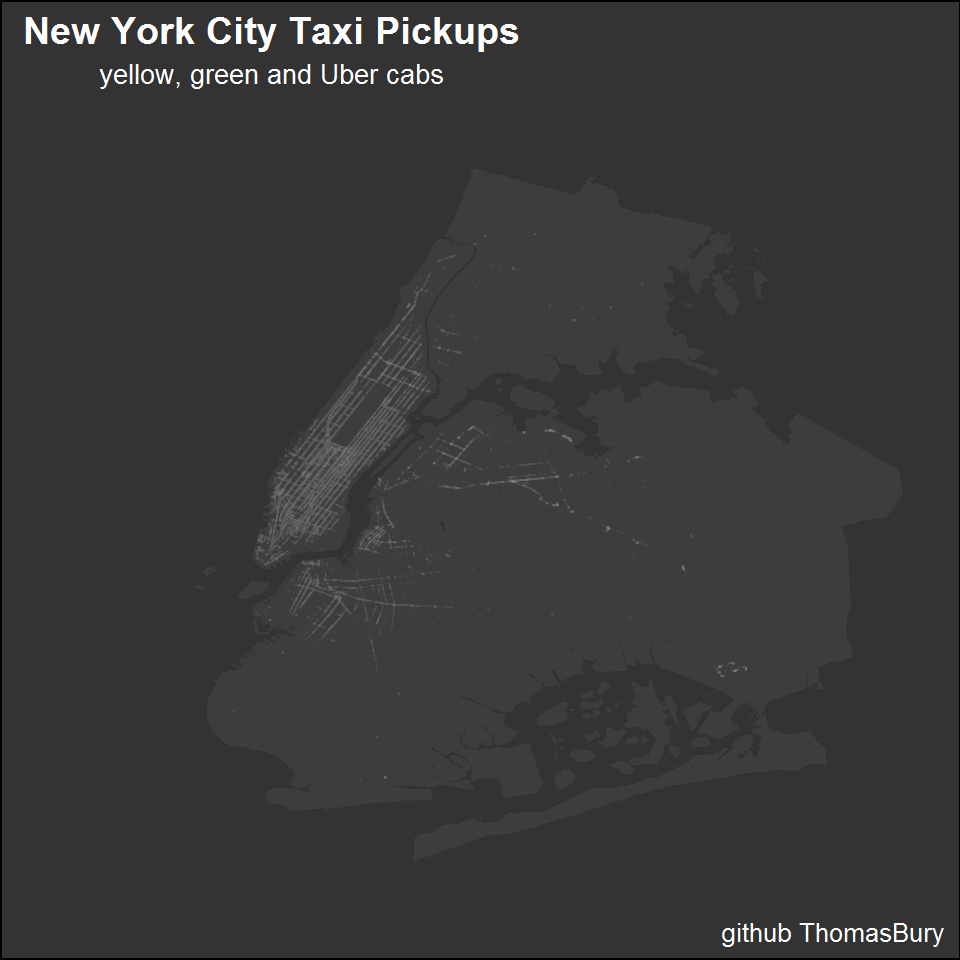

Last, the buda scico palette

``` r
alpha_range = c(0.005, 0.02)

# quantile breaks
#breaks_vec = as.numeric(quantile(log(log(ygv_taxi[N>5 & drop == "on"]$N)), seq(0,1,.1)))

# log breaks
breaks_vec = exp(seq(log( min(log(log(ygv_taxi[N>5 & drop == "on"]$N)))  ), log( max(log(log(ygv_taxi[N>5 & drop == "on"]$N)))  ), length.out = 10))

p_ygv_sc = ggplot() +
  geom_polygon(data = ex_staten_island_map,
               aes(x = long, y = lat, group = group),
               fill = "#3d3d3d", color = "#3d3d3d") +
  geom_point(data = ygv_taxi[N>5 & drop == "on"],
             aes(x = longitude, y = latitude, color = log(log(N)), alpha = log(log(N))), size = .01) +
  scale_alpha_continuous(range = alpha_range, breaks = rev(breaks_vec)) +
  title_with_subtitle("New York City Taxi Pickups", "yellow, green and Uber cabs") +
  theme_dark_map(base_size = 24) + scico::scale_colour_scico(palette = "buda", breaks = breaks_vec, 
                                                             limits=c(breaks_vec[1], breaks_vec[10]), direction = 1) +
  theme(legend.position = "none") + labs(caption="github ThomasBury")


p_ygv_sc
```

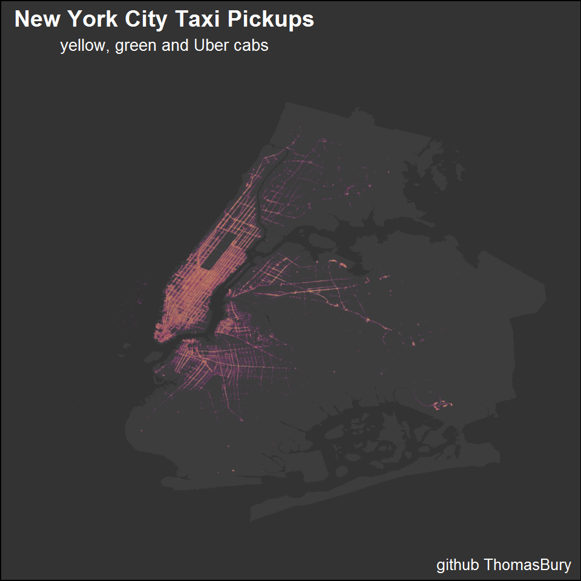

Drop-offs
---------

``` r
p_y = ggplot() +
  geom_polygon(data = ex_staten_island_map,
               aes(x = long, y = lat, group = group),
               fill = "#3d3d3d", color = "#3d3d3d") +
  geom_point(data = taxi_trip_dropoff[N>3],
             aes(x = longitude, y = latitude), color = "#f4cb38", alpha = .006, size = .01 ) +
  title_with_subtitle("New York City Taxi Dropoffs", "2014") +
  theme_dark_map(base_size = 24) +
  theme(legend.position = "none") + labs(caption="github ThomasBury")

p_g = ggplot() +
  geom_polygon(data = ex_staten_island_map,
               aes(x = long, y = lat, group = group),
               fill = "#3d3d3d", color = "#3d3d3d") +
  geom_point(data = g_taxi_trip_dropoff[N>3],
             aes(x = longitude, y = latitude), color = "#4bd87f", alpha = .006, size = .01 ) +
  title_with_subtitle("New York City Green Taxi Dropoffs", "2016") +
  theme_dark_map(base_size = 24) +
  theme(legend.position = "none") + labs(caption="github ThomasBury")


plot_grid(p_y, p_g, ncol=2)
```

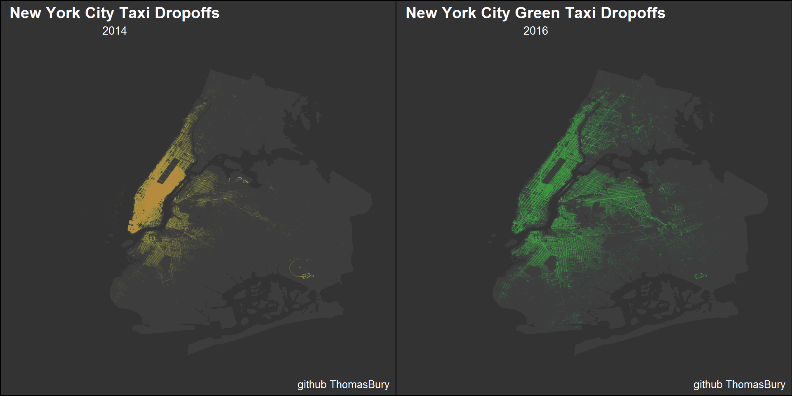

Combine the yellow and green cabs

``` r
# alpha_range = c(0.2, 0.8)
# size_range = c(0.134, 0.173)

colors_taxi = c("#FFEA00", "#4bd87f", "#1EBAD6")

p_ygv = ggplot() +
  geom_polygon(data = ex_staten_island_map,
               aes(x = long, y = lat, group = group),
               fill = "#3d3d3d", color = "#3d3d3d") +
  geom_point(data = ygv_taxi[N>3 & drop == "off"],
             aes(x = longitude, y = latitude, color = col_tax), alpha = .006, size = .01 ) +
  title_with_subtitle("New York City Taxi Dropoffs", "yellowand green cabs") +
  theme_dark_map(base_size = 24) + scale_colour_manual(values = colors_taxi) + 
  theme(legend.position = "none") + labs(caption="github ThomasBury")


p_ygv
```

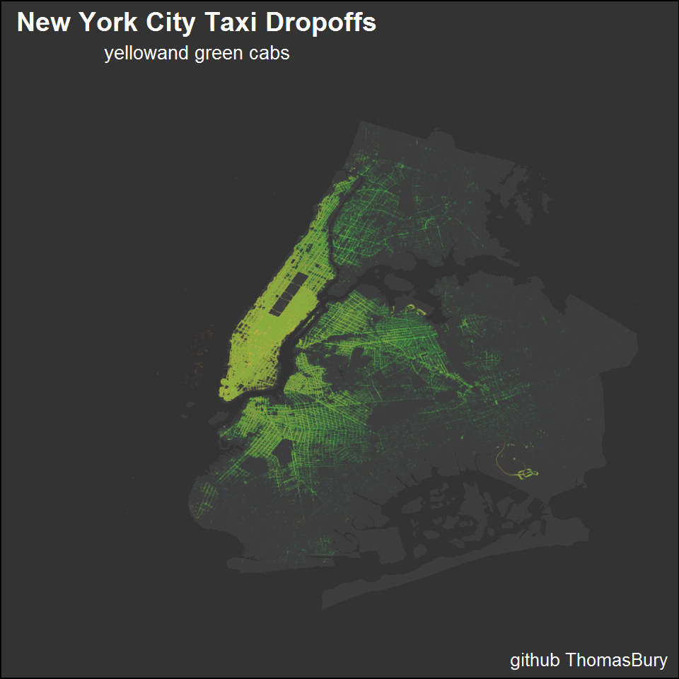

Use colour palette to highlight large numbers of dropoffs

``` r
alpha_range = c(0.005, 0.02)
size_range = c(0.01, 0.05)

# quantile breaks
#breaks_vec = as.numeric(quantile(log(log(ygv_taxi[N>5 & drop == "off"]$N)), seq(0,1,.1)))

# log-breaks
breaks_vec = exp(seq(log( min(log(log(ygv_taxi[N>5 & drop == "off"]$N)))  ), log( max(log(log(ygv_taxi[N>5 & drop == "off"]$N)))  ), length.out = 10))


p_ygv_sc = ggplot() +
  geom_polygon(data = ex_staten_island_map,
               aes(x = long, y = lat, group = group),
               fill = "#3d3d3d", color = "#3d3d3d") +
  geom_point(data = ygv_taxi[N>5 & drop == "off"],
             aes(x = longitude, y = latitude, color = log(log(N)), alpha = log(log(N)), size = log(log(N)))) +
  scale_alpha_continuous(range = alpha_range, breaks = breaks_vec) +
  scale_size_continuous(range = size_range, breaks = breaks_vec) +
  title_with_subtitle("New York City Taxi Dropoffs", "yellow and green cabs") +
  theme_dark_map(base_size = 24) + scale_color_viridis(option = "A", breaks = breaks_vec, limits=c(breaks_vec[1], breaks_vec[8]))  +
  theme(legend.position = "none") + labs(caption="github ThomasBury")


p_ygv_sc
```

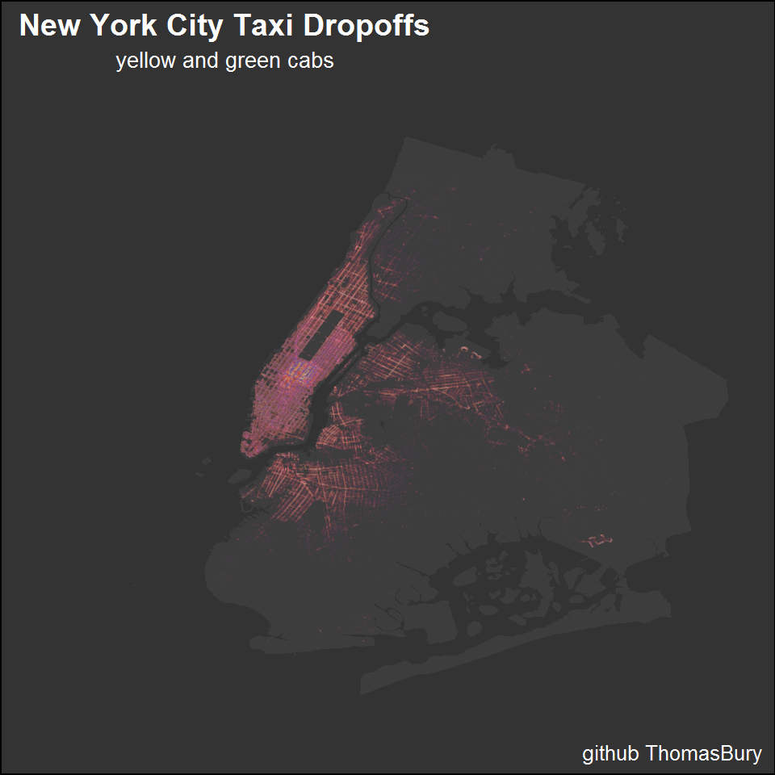

Or just a single colour alpha-modulated

``` r
alpha_range = c(0.005, 0.02)

# quantile breaks
breaks_vec = as.numeric(quantile(log(log(ygv_taxi[N>5 & drop == "off"]$N)), seq(0,1,.1)))

p_ygv_sc = ggplot() +
  geom_polygon(data = ex_staten_island_map,
               aes(x = long, y = lat, group = group),
               fill = "#3d3d3d", color = "#3d3d3d") +
  geom_point(data = ygv_taxi[N>5 & drop == "off"],
             aes(x = longitude, y = latitude, alpha = log(log(N))), size = .0025, color = "gold") +
  scale_alpha_continuous(range = alpha_range, breaks = breaks_vec) +
  title_with_subtitle("New York City Taxi Dropoffs", "yellow and green cabs") +
  theme_dark_map(base_size = 24) + scico::scale_colour_scico(palette = "grayC", breaks = breaks_vec, 
                                                             limits=c(breaks_vec[1], breaks_vec[10]), direction = -1)  +
  theme(legend.position = "none") + labs(caption="github ThomasBury")


p_ygv_sc
```

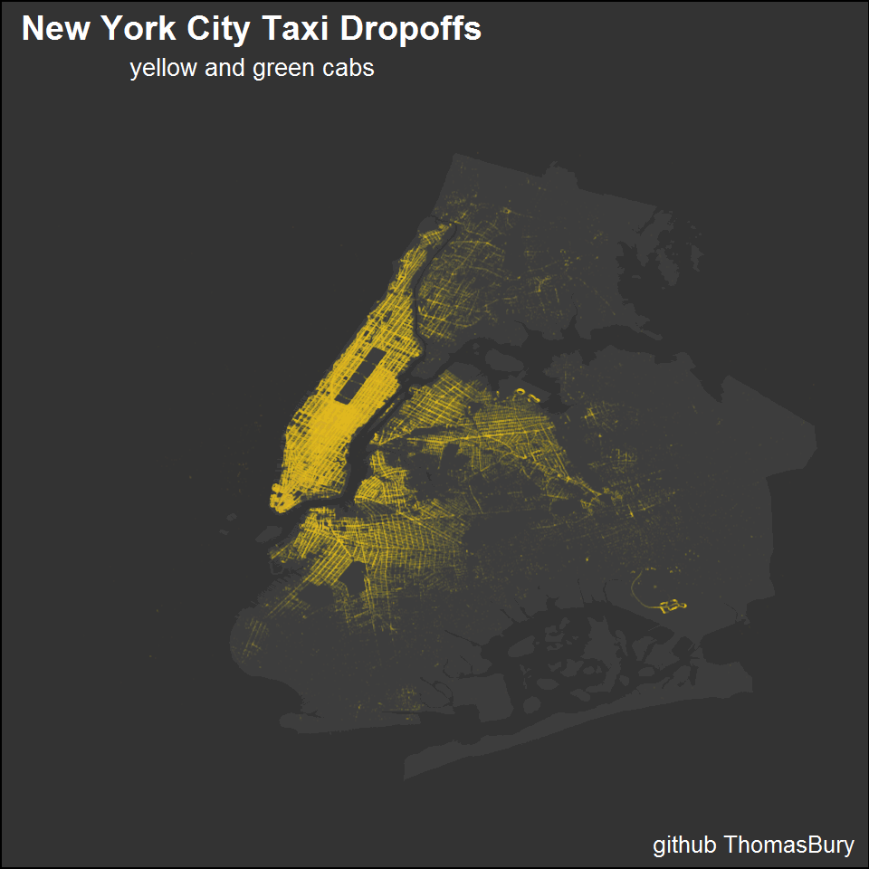

Last, some palettes coming from the scico package

``` r
alpha_range = c(0.005, 0.02)
# quantile breaks
breaks_vec = as.numeric(quantile(log(log(ygv_taxi[N>5 & drop == "off"]$N)), seq(0,1,.1)))

# log-breaks
# breaks_vec = exp(seq(log( min(log(log(ygv_taxi[N>5 & drop == "off"]$N)))  ), log( max(log(log(ygv_taxi[N>5 & drop == "off"]$N)))  ), length.out = 10))

p_ygv_sc = ggplot() +
  geom_polygon(data = ex_staten_island_map,
               aes(x = long, y = lat, group = group),
               fill = "#3d3d3d", color = "#3d3d3d") +
  geom_point(data = ygv_taxi[N>5 & drop == "off"],
             aes(x = longitude, y = latitude, color = log(log(N)), alpha = log(log(N))), size = .01) +
  scale_alpha_continuous(range = alpha_range, breaks = breaks_vec) +
  title_with_subtitle("New York City Taxi Dropoffs", "yellow and green cabs") +
  theme_dark_map(base_size = 24) + scico::scale_colour_scico(palette = "grayC", breaks = breaks_vec, 
                                                             limits=c(breaks_vec[1], breaks_vec[10]), direction = -1)  +
  theme(legend.position = "none") + labs(caption="github ThomasBury")


p_ygv_sc
```

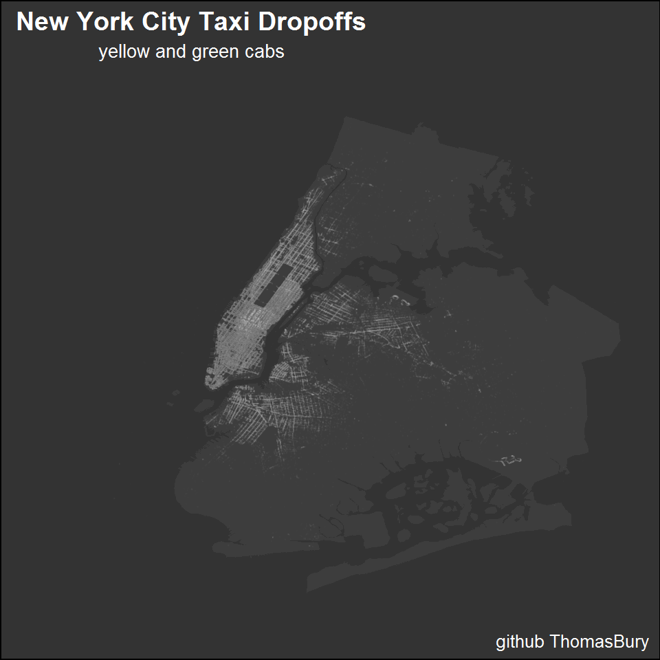

The imola colour palette look good too

``` r
alpha_range = c(0.005, 0.02)

# quantile breaks
#breaks_vec = as.numeric(quantile(log(log(ygv_taxi[N>5 & drop == "off"]$N)), seq(0,1,.1)))

# log-breaks
breaks_vec = exp(seq(log( min(log(log(ygv_taxi[N>5 & drop == "off"]$N)))  ), log( max(log(log(ygv_taxi[N>5 & drop == "off"]$N)))  ), length.out = 10))

p_ygv_sc = ggplot() +
  geom_polygon(data = ex_staten_island_map,
               aes(x = long, y = lat, group = group),
               fill = "#3d3d3d", color = "#3d3d3d") +
  geom_point(data = ygv_taxi[N>5 & drop == "on"],
             aes(x = longitude, y = latitude, color = log(log(N)), alpha = log(log(N))), size = .01) +
  scale_alpha_continuous(range = alpha_range, breaks = breaks_vec) +
  title_with_subtitle("New York City Taxi Dropoffs", "yellow and green cabs") +
  theme_dark_map(base_size = 24) + scico::scale_colour_scico(palette = "imola", breaks = breaks_vec, 
                                                             limits=c(breaks_vec[1], breaks_vec[10]), direction = 1) +
  theme(legend.position = "none") + labs(caption="github ThomasBury")


p_ygv_sc
```

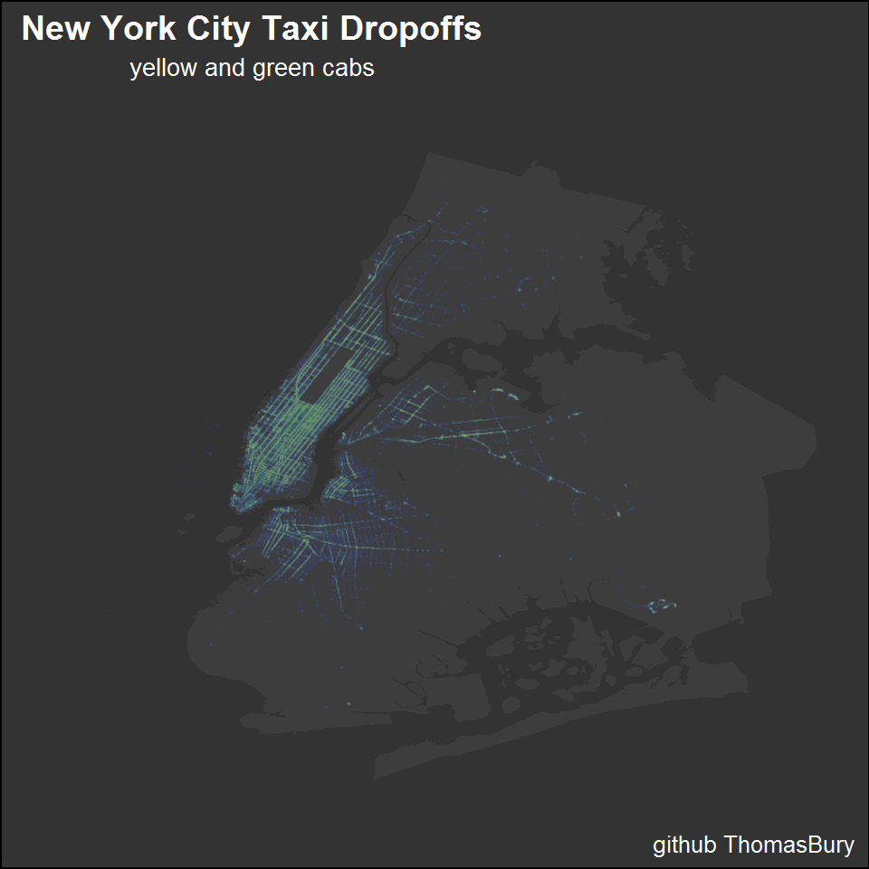

The buda colour palette

``` r
alpha_range = c(0.005, 0.02)

# quantile breaks
#breaks_vec = as.numeric(quantile(log(log(ygv_taxi[N>5 & drop == "off"]$N)), seq(0,1,.1)))

# log breaks
breaks_vec = exp(seq(log( min(log(log(ygv_taxi[N>5 & drop == "off"]$N)))  ), log( max(log(log(ygv_taxi[N>5 & drop == "off"]$N)))  ), length.out = 10))

p_ygv_sc = ggplot() +
  geom_polygon(data = ex_staten_island_map,
               aes(x = long, y = lat, group = group),
               fill = "#3d3d3d", color = "#3d3d3d") +
  geom_point(data = ygv_taxi[N>5 & drop == "on"],
             aes(x = longitude, y = latitude, color = log(log(N)), alpha = log(log(N))), size = .01) +
  scale_alpha_continuous(range = alpha_range, breaks = breaks_vec) +
  title_with_subtitle("New York City Taxi Dropoffs", "yellow and green cabs") +
  theme_dark_map(base_size = 24) + scico::scale_colour_scico(palette = "buda", breaks = breaks_vec, 
                                                             limits=c(breaks_vec[1], breaks_vec[11]), direction = 1) +
  theme(legend.position = "none") + labs(caption="github ThomasBury")


p_ygv_sc
```

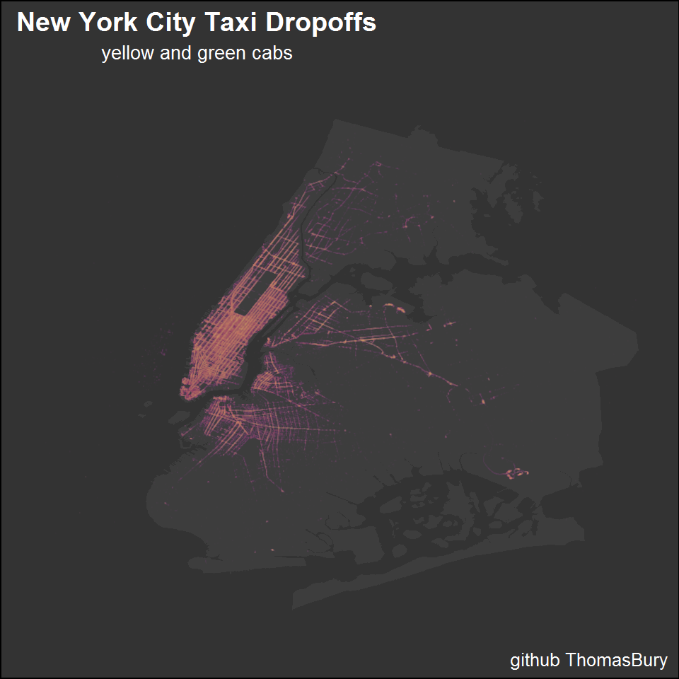
